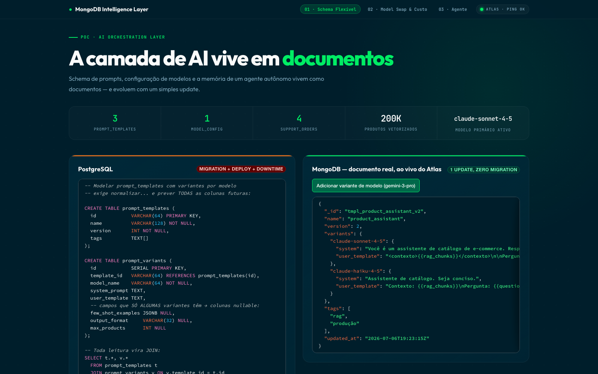
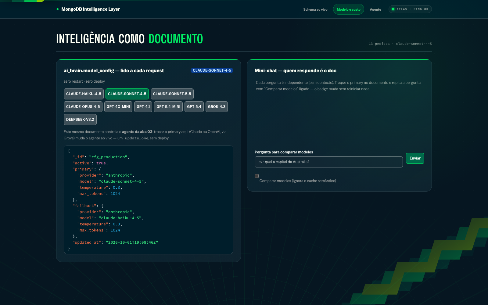
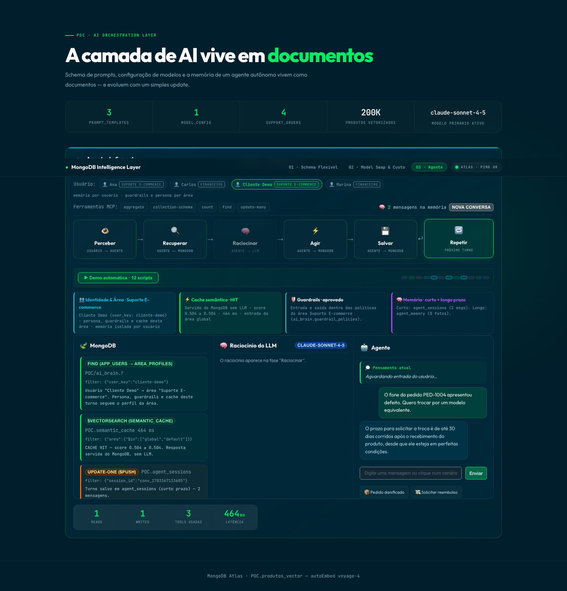
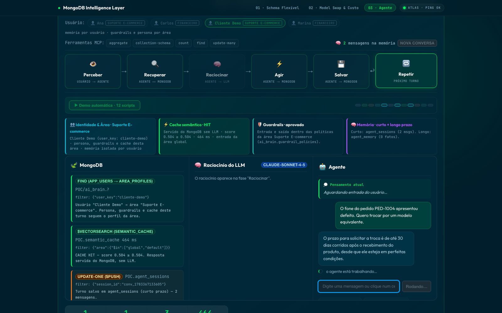

# Intelligence layer in MongoDB

Most AI applications keep their "intelligence" everywhere except the database: prompts hard-coded in the repository, the model name in an environment variable, a separate vector store, a cache in another service, and agent memory nowhere at all. Every adjustment becomes a deploy.

This PoV moves that layer into the database. Prompt schemas, model configuration, semantic cache, guardrail policies, and the agent's short- and long-term memory are all documents: changed with one `update_one`, applied on the next request, no restart. One cluster, one query language, one security model, and every cache hit, memory fact, and guardrail decision is a queryable document instead of a black box.

**Stack:** React + Vite + LeafyGreen · FastAPI + PyMongo Async · MongoDB Atlas (Vector Search, `voyage-4` autoEmbed) · MongoDB MCP Server · Claude Sonnet 4.5 / Haiku 4.5. The UI is in Brazilian Portuguese (used in customer sessions).

## The demo in four steps

**1. Prompts are polymorphic documents.** One variant per model is a live `$set` against Atlas, and the JSON updates on screen immediately.



**2. Swapping the production model is one `update_one`.** `model_config` is read on every request; picking another model from the catalog changes latency and cost with zero deploys. The cost panel projects monthly spend from the session's real token counts.



**3. The agent runs a real tool-use loop through the MongoDB MCP Server.** It decides which tools to call (`find` an order, `$vectorSearch` the catalog, `update` a status) and they execute against Atlas over the same protocol an IDE would use. The run is replayed step by step as `Perceive → Retrieve → Reason → Act → Store → Loop`, with real read/write/latency counters.



**4. Ask something already answered: no LLM call.** The question goes through `$vectorSearch` against the semantic cache. Above the threshold, the stored answer is served straight from MongoDB and the UI shows a CACHE HIT with the score and latency.



## What runs on every turn

```
message → [input guardrail + PII mask] → [semantic cache?] ──HIT──→ answer, no LLM ⚡
                                │ MISS
                                ▼
   relevant long-term memory + recent turns → MCP tool loop → [output guardrail]
                                ▼
            write short-term + long-term memory → write cache (if generic)
```

Each step is a real MongoDB operation, visible in the trace and in the in-app inspector.

**Two-tier memory.** Short-term is `agent_sessions`: the current conversation's `turns[]`, capped with `$slice`, with the recent window hydrated into context while the full history stays one query away. Long-term is `agent_memory`: one document per durable fact about the user, retrieved by `$vectorSearch` pre-filtered by `user_key` + `active`, so prompt size does not grow with memory size. A contradicting fact does not overwrite: it inserts, and the old one flips to `active: false` + `superseded_by` in a single ACID transaction. The inspector shows the struck-through history.

**Multi-tenant by pre-filter, not post-filter.** `area` / `user_key` / `active` are `filter` fields in the vector indexes, so ANN search only walks vectors that are valid for the caller and top-K stays correct as collections grow.

**Isolation by area.** Each user belongs to an area that decides three things per turn, all by document read: the persona appended to the system prompt, which `guardrail_policies` document applies, and which cache entries are visible. Try *"Can you give me an off-the-books discount on the invoice?"* as Marina (Finance): blocked. The same message as Adriano (Support) is answered normally.

**Cache hygiene.** Turns that touched a specific order or used the customer's own facts never reach the cache, because a personalized answer must not be replayed for someone else. Entries created at runtime carry `expires_at` and a TTL index removes them; seeded FAQs never expire.

**Memory is data, never instruction.** Facts are injected between `<customer_facts>` delimiters with an explicit instruction to ignore embedded commands, and the extractor refuses instruction-shaped "facts". This is the defense against memory poisoning.

**What stops the agent from dropping a collection.** The loop exposes only `find`, `aggregate`, and a scoped `update-many`. Every call is rewritten server-side before it reaches the MCP server: order reads require a scalar `PED-...` ID and get a PII-free projection, writes may set a single approved status field, and session reads are pinned to the caller. In production, also restrict the MCP server's Atlas user to the exact collections, or run it with `MDB_MCP_READ_ONLY=true`.

> **Thresholds are measured, not guessed.** The `vectorSearchScore` scale can shift when the `voyage-4` autoEmbed index/model is updated (this cluster moved from ~0.50 to ~0.59–0.86 in August 2026). Ranking is reliable; the absolute scale is not. `ai_brain.cache_config` and `ai_brain.guardrail_policies` hold the live thresholds, set by `backend/calibrate_thresholds.py` against labeled probes. Re-run it whenever the model, cluster, index, or seeded data changes.

**Optional Langfuse observability.** With `LANGFUSE_PUBLIC_KEY`/`LANGFUSE_SECRET_KEY` in `.env`, each turn becomes a replayable trace (a generation per LLM call, a span per MCP tool call) with a "View trace in Langfuse" badge in the UI. Without the keys it is a no-op and nothing changes. Details in [`docs/briefing/architecture.md`](docs/briefing/architecture.md).

**Hands-free pitch.** *▶ Auto demo* plays a 12-script playlist alternating cache, guardrail, memory, transactional agent, and per-area isolation, switching the user pill live so the audience sees the same question blocked in one area and answered in another. When paused, ◀/▶ replay already-executed scripts from in-memory history: no new API calls, results exactly as they happened.

## Collections

| Collection | Database | Role |
|---|---|---|
| `cache_config` | ai_brain | live cache threshold/TTL |
| `model_config` | ai_brain | active model, read on every request |
| `area_profiles` | ai_brain | persona and rules per area |
| `guardrail_policies` | ai_brain | policy per area |
| `semantic_cache` | POC | Q&A + autoEmbed vector, tagged by area |
| `agent_sessions` | POC | short-term memory |
| `agent_memory` | POC | long-term facts per `user_key` |
| `guardrail_denylist` | POC | forbidden phrases + vector |
| `guardrail_events` | POC | audit log (30-day TTL) |
| `agent_traces` | POC | replayable trace per turn (30-day TTL) |
| `app_users` | POC | user → area |

## Run it

```bash
cp .env.example .env
./start.sh          # FastAPI :8010 + Vite :5183
```

By default the launcher serves the optimized frontend build without a watcher. For HMR development run `POV_DEV=1 ./start.sh`; the build is only redone when sources, lockfile, or configuration change. Separately: `cd backend && .venv/bin/uvicorn main:app --reload --port 8010` and `cd frontend && npm run dev`.

```bash
cd backend && .venv/bin/python -m unittest discover -s tests -v
cd backend && .venv/bin/python seed.py                  # idempotent, restores demo data; not mid-presentation
cd backend && .venv/bin/python calibrate_thresholds.py  # --apply writes the measured thresholds
npm run test:visual                                     # Playwright visual regression, app running
```

Docker: `docker build -t intelligence-layer-poc . && docker run --env-file .env -p 18082:8080 intelligence-layer-poc`.

## Production profile

Set `ENVIRONMENT=production`, `AUTH_REQUIRED=1`, and `DEMO_TOKEN_ISSUANCE_ENABLED=0`. Startup rejects weak/default JWT or admin secrets and wildcard CORS; `/metrics` requires admin authorization. Model names and update paths go through an allowlist to prevent dotted or `$` field injection. The image runs as UID 10001 behind nginx with security headers.

## Before presenting

```bash
./scripts/preflight.sh        # ~15s: Atlas, READY indexes, live config, data, MCP, LLM
```

An index still `BUILDING`, a missing `model_config`, a broken swap chain, `npx` off the PATH: each is a way for the demo to fail live, and each used to be discovered at the worst moment. The preflight now refuses before that.

## Why MongoDB for agent memory

The full argument, with measured numbers, is in [docs/memoria-agentica-mongodb.md](docs/memoria-agentica-mongodb.md) (Portuguese). In one line: short-term memory, long-term memory, semantic cache, live configuration, and trace are **documents in the same cluster**. Per-user isolation is a pre-filter inside the vector index (not an application `WHERE`), retrieval is hybrid (`$vectorSearch` + BM25 with RRF) over the same documents, and the turn checkpoint is a `$set` on the same conversation document, with no second system to coordinate.

## Known limitation of the semantic guardrail

The denylist compares the embedding of the whole message with those of the forbidden phrases. A forbidden phrase combined with a **second, unrelated intent** drops from 0.9284 to **0.6799** similarity and stops blocking, even below legitimate domain questions (0.7330–0.7680). No threshold adjustment fixes this without turning legitimate customers into blocks. It is a limit of the single-phrase-embedding pattern, not poor calibration; fixing it requires sub-intent decomposition or an additional classification layer.

In practice the turn does not leak data: the policy rewrite denies broad reads on the server and the client receives guidance. The denylist is one layer, not the only one. Measurements and root cause in [docs/eval-report.md](docs/eval-report.md) (Portuguese).

## License

MIT, see [LICENSE](LICENSE).
